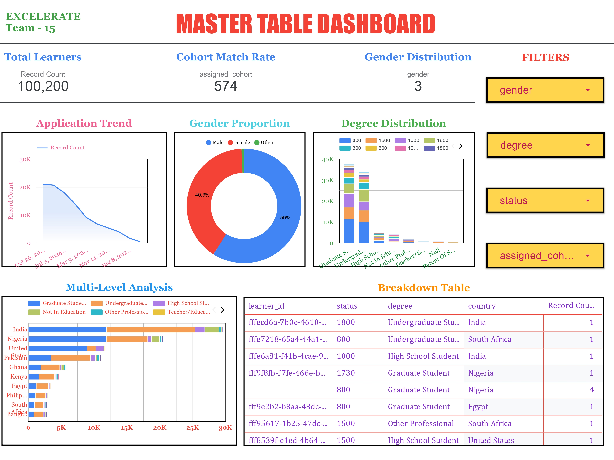

# 📊Data Analyst Associate Internship

## 🚀 Executive Summary

This project involved transforming six fragmented raw datasets into analytics-ready structures using robust ETL automation and advanced data validation. Five datasets were integrated into a unified **Master Table**, while one (Marketing Campaign Data) was analyzed separately. The result is a clean, consistent and scalable data environment that enables advanced analytics and business intelligence.

Dashboard Link - https://lookerstudio.google.com/reporting/751c83f0-9812-494f-bd94-6e15d1c53a30

---

## 🎯 Project Objective

To transform inconsistent, duplicated and siloed raw data into a high-quality, structured format that supports strategic reporting, dashboarding and decision-making, achieved by designing and automating a repeatable **ETL process** with strong validation checks.

---

## 🧩 Business Problem

### Key Challenges in Raw Data -
- Up to **33% missing values** in key datasets.
- **Text/date format inconsistencies** across datasets.
- **Duplicate/unreliable records** compromising data integrity.
- **No relational joins** among datasets.
  
### Business Need -
To create a **trusted, integrated data ecosystem** for reporting, visualization and strategy formulation.

---

## 🗂️ Data Sources Overview

| Dataset               | Records | Fields | Primary Key          |
|-----------------------|---------|--------|----------------------|
| Learner Data          | 129,259 | 5      | learner_id           |
| Opportunity Data      | 187     | 5      | opportunity_id       |
| Cohort Data           | 639     | 5      | cohort_code          |
| Learner-Opportunity   | 113,602 | 5      | enrollment_id        |
| Cognito Data          | 129,178 | 9      | user_id              |
| Marketing Campaign    | 155     | 13     | *No Primary Key*     |

---

## 🔄 ETL Process Overview

- **Data Extraction -** Raw CSV imports into PostgreSQL.
- **Cleaning -** Using SQL functions like `TRIM()`, `INITCAP()`, `TO_DATE()`.
- **Standardization -** Consistent text casing and field formats.
- **Validation -** Regex for date integrity, duplicate removal, NULL preservation.
- **Integration -** Created **Master Table** with 5 datasets (excluding Marketing).
- **Automation -** End-to-end ETL automated using **stored procedures**.

---

## 🏗️ Master Table Fields

- **From Learner-Opportunity -** `enrollment_id`, `assigned_cohort`, `apply_date`, `status`
- **From Learner -** `learner_id`, `degree`, `institution`, `major`, `country`
- **From Cohort -** `start_date`, `end_date`, `size`
- **From Cognito -** `email`, `gender`, `birthday`, `city`, `zip`, `state`
- **From Opportunity -** `opportunity_id`, `opportunity_name`, `category`, `tracking_questions`

---

## 📐 Data Quality Improvements

- ✅ Whitespace removal
- ✅ Standard casing (e.g., `INITCAP()`, `UPPER()`)
- ✅ Date format validation
- ✅ Deduplication using `DISTINCT`
- ✅ Preserved NULLs where applicable

---

## 📊 Key Insights

1. **❗ Missing Demographic Data (33%)**  
   → Recommendation - Strengthen registration form validations.

2. **📉 Status Code 1070 Dominance (67%)**  
   → Suggests program bottlenecks or lifecycle issues.

3. **📆 Cohort Duration Anomalies**  
   → Some 0-day durations point to faulty entries.

4. **📈 Marketing Data Isolation**  
   → Campaigns unlinked from learners; implement UTM tracking.

---

## 🧠 Additional Insights

- **📛 Outlier Birthdates** → Users under 5 or over 100 years → Needs input validation.
- **🎯 Learner Engagement Skewed**  
  → Only 0.14% learners generated 99.86% of opportunity engagement.

---

## 📏 Validation Metrics

- ✅ Over **90% completeness** in the Master Table.
- ✅ Date, text and numeric format consistency.
- ✅ Referential integrity between `learner`, `cohort` and `opportunity` exceeded **85%** match rate.

---

## ⚔️ Challenges vs Resolutions

| Challenge | Resolution |
|----------|------------|
| Fragmented datasets | Master table design with JOINs |
| Missing keys in Marketing | Analyzed independently |
| Outliers in demographics | Input validation rules proposed |
| High learner inactivity | Targeted engagement strategies |

---

## 📈 Business Impact

- 📌 A scalable ETL pipeline now automates data preparation.
- 📌 Structured data enables real-time dashboards and predictive modeling.
- 📌 Data reliability improved significantly with ~90%+ field completeness.
- 📌 Data environment is now analytics-ready for strategic use.

---

## 🧭 Next Steps

- 📊 Enable **predictive analytics** using clean datasets.
- 🔁 Extend ETL to **real-time or near-real-time pipelines**.
- 🔍 Set up **continuous Data Quality Monitoring**.
- 📣 Improve campaign ROI visibility by enhancing attribution tracking.

---

## ✅ Final Takeaways

- Built a **trustworthy, consolidated data foundation**.
- Automated ETL process ensures **repeatability and scale**.
- Delivered **business-critical insights** to guide strategic action.
- Positioned the organization for advanced analytics maturity
